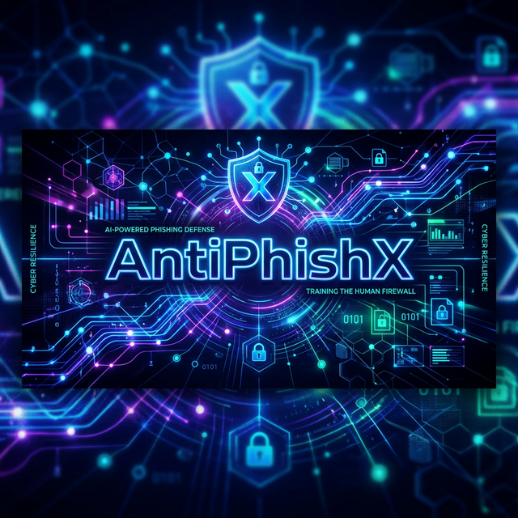

# AntiPhishX



AntiPhishX is a comprehensive, role-based cybersecurity training platform designed to actively teach users how to detect and prevent phishing attacks and other social engineering threats. The system includes interactive simulation labs, curated courses, gamification elements, robust analytics dashboards, and an integrated AI cybersecurity mentor.

## 🚀 Features

### Role-Based Access Control
The platform is built around three core roles, each with specialized interfaces and capabilities:

- **👑 Admin**
  - Manage users across the entire platform
  - Monitor comprehensive system health and security logs
  - Access platform-wide analytics and performance data

- **👨‍🏫 Instructor**
  - Author and publish cybersecurity courses and training modules
  - Design interactive phishing simulation labs and quizzes
  - Track learner progress and course completion rates

- **🎓 Learner**
  - Participate in hands-on phishing simulation labs
  - Complete cybersecurity courses, quizzes, and assessments
  - Earn XP, unlock achievements, and generate verifiable certificates

### Key Modules

1. **Simulation Labs**: Interactive environments focusing on Email phishing, SMS phishing, and more.
2. **Interactive Courses**: Video-based and text-based modules teaching core security principles.
3. **Quizzes & Assessments**: Verification routines to ensure knowledge retention.
4. **Gamification Engine**: An XP and achievement system built to incentivize continuous learning.
5. **AI Guardian (Mentor)**: An integrated AI assistant powered by Groq to help users understand complex security topics.
6. **Notification System**: Real-time alerts for system events, quiz results, and achievements.

## 🛠️ Tech Stack

**Frontend:**
- React 18
- Vite
- Tailwind CSS
- Framer Motion (Animations)
- Lucide React (Icons)
- React Router DOM
- Axios

**Backend:**
- Node.js & Express
- MongoDB (Mongoose)
- JSON Web Tokens (JWT) for Authentication
- Bcrypt.js / Argon2 for Password Hashing
- Cloudinary (Media/Video Storage)
- Groq Cloud API (AI Integration)

## 📦 Local Development Setup

### Prerequisites
- Node.js (v18 or higher)
- MongoDB running locally or a MongoDB Atlas URI
- API Keys for Cloudinary and Groq

### 1. Clone the repository
```bash
git clone https://github.com/pchaitanya921/AntiPhishX.git
cd AntiPhishX
```

### 2. Backend Setup
```bash
cd backend
npm install
```
Create a `.env` file in the `backend` directory:
```env
NODE_ENV=development
PORT=5000
MONGODB_URI=mongodb://localhost:27017/antiphishx
JWT_PRIVATE_KEY=your_secure_private_key
JWT_PUBLIC_KEY=your_secure_public_key
SESSION_SECRET=your_session_secret
FRONTEND_URL=http://localhost:5173
CORS_ORIGIN=http://localhost:5173

# Third-party APIs
CLOUDINARY_CLOUD_NAME=your_cloudinary_name
CLOUDINARY_API_KEY=your_cloudinary_api_key
CLOUDINARY_API_SECRET=your_cloudinary_api_secret
GROQ_API_KEY=your_groq_api_key
```
Start the backend development server:
```bash
npm run dev
```

### 3. Frontend Setup
Open a new terminal window:
```bash
cd frontend
npm install
```
Create a `.env.local` file in the `frontend` directory:
```env
VITE_API_URL=http://localhost:5000/api
```
Start the frontend development server:
```bash
npm run dev
```

## 🌐 Production Deployment

The platform is designed to be deployed across modern cloud providers:
- **Backend:** Designed for Render, Heroku, or DigitalOcean App Platform.
- **Frontend:** Optimized for Vercel, Netlify, or Cloudflare Pages.
- **Database:** MongoDB Atlas is recommended for production.

Ensure that the `VITE_API_URL` on the frontend is pointing to your deployed backend URL, and that the `CORS_ORIGIN` on the backend allows requests from your deployed frontend domain.

## 📄 License

This project is licensed under the MIT License - see the [LICENSE](LICENSE) file for details.
